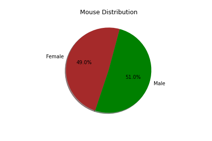
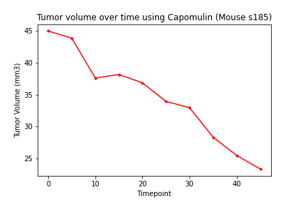

# Matplotlib Homework - The Power of Plots

## Background

What good is data without a good plot to tell the story?

So, let's take what you've learned about Python Matplotlib and apply it to a real-world situation and dataset:

<p align="center">
  
</p>

While your data companions rushed off to jobs in finance and government, you remained adamant that science was the way for you. Staying true to your mission, you've joined Pymaceuticals Inc., a burgeoning pharmaceutical company based out of San Diego. Pymaceuticals specializes in anti-cancer pharmaceuticals. In its most recent efforts, it began screening for potential treatments for squamous cell carcinoma (SCC), a commonly occurring form of skin cancer.

As a senior data analyst at the company, you've been given access to the complete data from their most recent animal study. In this study, 249 mice identified with SCC tumor growth were treated through a variety of drug regimens. Over the course of 45 days, tumor development was observed and measured. The purpose of this study was to compare the performance of Pymaceuticals' drug of interest, Capomulin, versus the other treatment regimens. You have been tasked by the executive team to generate all of the tables and figures needed for the technical report of the study. The executive team also has asked for a top-level summary of the study results.

### Summary Statistics

* Create two summary statistics tables:

    * For the first table, use the `groupby` method to generate the mean, median, variance, standard deviation, and SEM of the tumor volume for each drug regimen. This should result in five unique series objects. Combine these objects into a single summary statistics table.
    * For the second table, use the `agg` method to produce the same summary statistics table using a single line of code.

### Bar Charts

* Generate two bar plots:

    * Both of these plots should be identical and should show the total number of timepoints for all mice tested for each drug regimen throughout the course of the study.
    * Create the first bar plot using Pandas's `DataFrame.plot()` method.
    * Create the second bar plot using Matplotlib's `pyplot` methods.

<details>
           <summary>Pandas bar Chart</summary>
           <p> </p>
</details>

<details>
           <summary>Matplotlib Bar Chart</summary>
           <p> </p>
</details>

### Pie Charts

* Generate two pie plots:

    * Both of these plots should be identical and should show the distribution of female or male mice in the study.
    * Create the first pie plot using both Pandas's `DataFrame.plot()`.
    * Create the second pie plot using Matplotlib's `pyplot` methods.

<details>
           <summary>Pandas Pie Chart</summary>
           <p> </p>
</details>

<details>
           <summary>Matplotlib Pie Chart</summary>
           <p> </p>
</details>


### Quartiles, Outliers and Boxplots

* Calculate the final tumor volume of each mouse across four of the most promising treatment regimens: Capomulin, Ramicane, Infubinol, and Ceftamin. Calculate the quartiles and IQR and quantitatively determine if there are any potential outliers across all four treatment regimens.

    * Start by creating a grouped DataFrame that shows the last (greatest) time point for each mouse, then merge this grouped DataFrame with the original cleaned DataFrame.
    * Next, create a list that holds the treatment names, as well as a second, empty list that will hold the tumor volume data.
    * Loop through each drug in the treatment list, locating the rows in the merged DataFrame that correspond to each treatment. Append the resulting final tumor volumes for each drug to the empty list. Determine outliers using the upper and lower bounds, then print the results.
    
* Using Matplotlib, generate a box and whisker plot of the final tumor volume for all four treatment regimens and highlight any potential outliers in the plot by changing their color and style.

```text
- - - - - - - - - - - - - -
IQR for Capomulin
The lower quartile of Capomulin is: 32.37735684
The upper quartile of Capomulin is: 40.1592203
The interquartile range of Capomulin is: 7.781863460000004
The the median of Capomulin is: 38.1251644 
Values below 20.70456164999999 could be outliers.
Values above 51.83201549 could be outliers.
- - - - - - - - - - - - - -
IQR for Ramicane
The lower quartile of Ramicane is: 31.56046955
The upper quartile of Ramicane is: 40.65900627
The interquartile range of Ramicane is: 9.098536719999998
The the median of Ramicane is: 36.56165229 
Values below 17.912664470000003 could be outliers.
Values above 54.30681135 could be outliers.
- - - - - - - - - - - - - -
IQR for Infubinol
The lower quartile of Infubinol is: 54.04860769
The upper quartile of Infubinol is: 65.52574285
The interquartile range of Infubinol is: 11.477135160000003
The the median of Infubinol is: 60.16518046 
Values below 36.83290494999999 could be outliers.
Values above 82.74144559000001 could be outliers.
- - - - - - - - - - - - - -
IQR for Ceftamin
The lower quartile of Ceftamin is: 48.72207785
The upper quartile of Ceftamin is: 64.29983003
The interquartile range of Ceftamin is: 15.577752179999997
The the median of Ceftamin is: 59.85195552 
Values below 25.355449580000002 could be outliers.
Values above 87.66645829999999 could be outliers.
- - - - - - - - - - - - - -
The only potential outlier was mouse c326 in the Infubinol regimen, with a tumor volume of 36.321346
 ```

<details>
           <summary>Boxplot</summary>
           <p> </p>
</details>

### Line and Scatter Plots

* Select a mouse that was treated with Capomulin and generate a line plot of tumor volume vs. time point for that mouse.

* Generate a scatter plot of tumor volume versus mouse weight for the Capomulin treatment regimen.

<details>
           <summary>Line Plot</summary>
           <p> </p>
</details>

<details>
           <summary>Scatter PLot</summary>
           <p> </p>
</details>

### Correlation and Regression

* Calculate the correlation coefficient and linear regression model between mouse weight and average tumor volume for the Capomulin treatment. Plot the linear regression model on top of the previous scatter plot.

<p align="center">
  
</p>

<details>
           <summary>Boxplot</summary>
           <p> </p>
</details>

### Final Analysis

* Look across all previously generated figures and tables and write at least three observations or inferences that can be made from the data. Include these observations at the top of the notebook.

